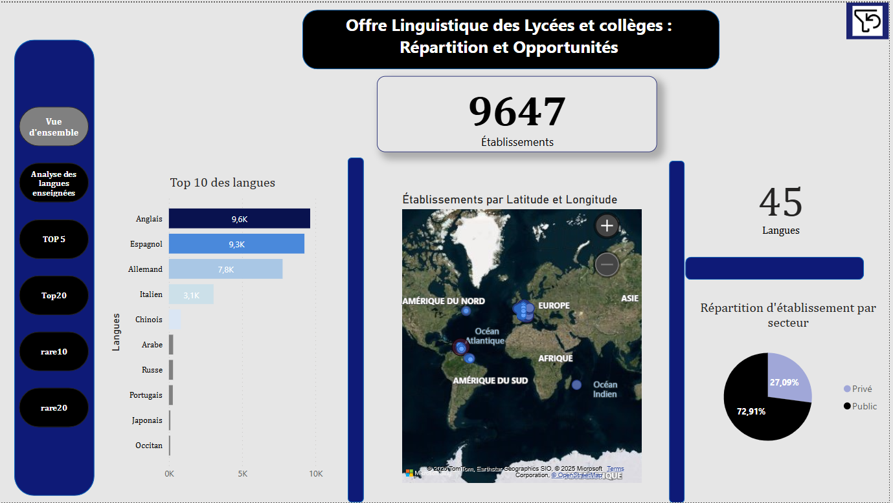

# Répartition Linguistique - Lycées et Collèges 🏫📊

## Présentation
Ce projet Power BI explore la **répartition des langues vivantes étrangères et régionales** enseignées dans les **collèges** et **lycées** en France.

En partant des données officielles issues du **Ministère de l’Éducation nationale**, j’ai voulu **visualiser et analyser** les tendances en matière d’enseignement des langues, en mettant en lumière la diversité, mais aussi les disparités selon les territoires.

---

## Objectifs 🎯
- Visualiser la **diversité linguistique** proposée dans les établissements scolaires.
- Identifier les **zones géographiques** où l’offre est restreinte ou inégale.
- Mettre en évidence les **limites d’accès** à certaines langues, notamment les **LV3** et les **langues régionales**.

---

## Données 📂
- **Source** : Ministère de l’Éducation nationale, de la Jeunesse et des Sports
- **Données** : Enseignement des langues vivantes dans les collèges et lycées
- **Année** : 2023

⚠️ **Note** : Les données utilisées sont publiques et ont été retraitées pour l’analyse dans Power BI.

---

## Contenu du projet 📁
| Fichier | Description |
|---------|-------------|
| `Repartition_Linguistique_Lycees_Colleges.pbix` | Rapport Power BI complet sur la répartition linguistique |
| `Langues1.png` | Capture d’écran du dashboard  |

---

## Aperçu du rapport 📸

---

## Principaux enseignements 🔍
- **Collèges** : uniquement **2 langues vivantes** proposées dans la majorité des cas.
- **Lycées** : offre élargie à **3 langues vivantes**, mais inégale selon les académies.
- **LV3** : quasi absentes dans certains territoires, notamment **Mayotte**.
- **Langues régionales** : enseignées dans **très peu d’établissements**, avec des exceptions comme le **futunien** en Outre-mer.

---

## Auteur ✍️
👩‍💻 **Annie Ivala**  
🔗 [Mon profil LinkedIn](https://www.linkedin.com/in/annie-ivala)

---

## Licence 📜
Projet en libre accès pour consultation et inspiration.  
⚠️ Merci de **citer la source** si vous réutilisez le contenu ou les analyses.

